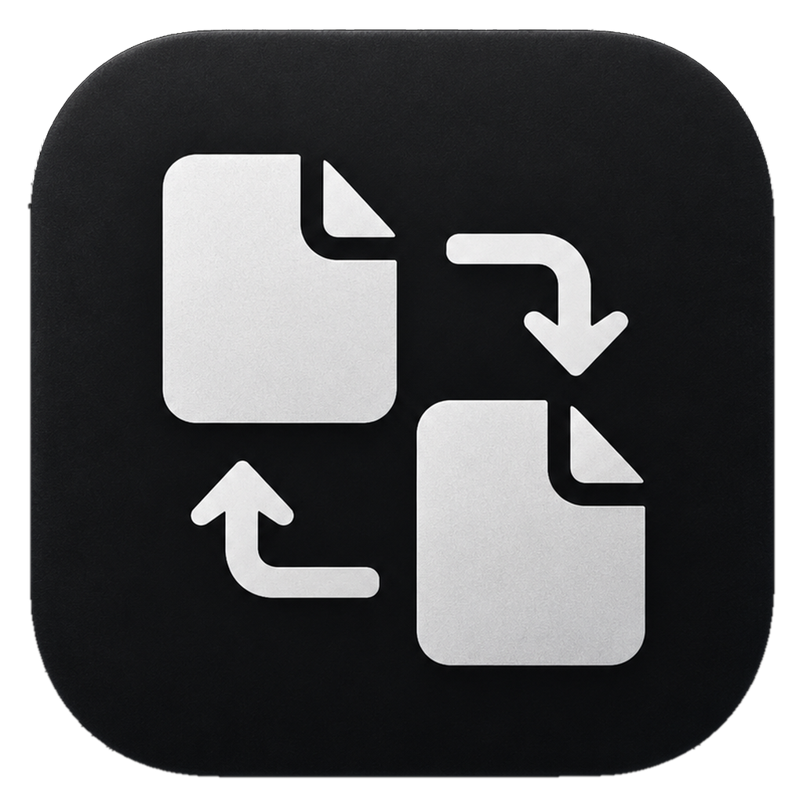
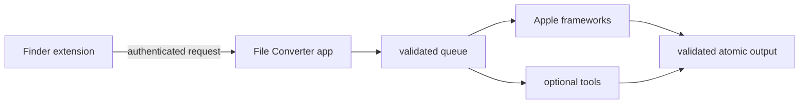

# File Converter for macOS

<p align="center">
  
</p>

<p align="center">
  <strong>Convert files locally, straight from Finder.</strong><br>
  Photos, video, audio, PDFs, office documents, and eBooks without uploads or shell commands.
</p>

<p align="center">
  <a href="https://github.com/Faw47/FileConverter/actions/workflows/ci.yml"></a>
  <a href="https://github.com/Faw47/FileConverter/stargazers"></a>
  <a href="https://github.com/Faw47/FileConverter/issues"></a>
  
  
</p>

<p align="center">
  <a href="#features">Features</a> ·
  <a href="#install-from-source">Install</a> ·
  <a href="#supported-formats">Formats</a> ·
  <a href="#contributing">Contributing</a>
</p>

File Converter is a Finder-first macOS app for turning files into useful formats with a readable recipe such as `HEIC → JPEG`, `PDF → PNG`, or `MOV → MP4`. Drop files into the app or select one file or a batch in Finder. The result is written locally beside the source by default.

If this saves you a command-line detour, [star the repository](https://github.com/Faw47/FileConverter) so other Mac users can find it.

> **Project status:** this is currently a source-first project. There is not yet a signed, notarized downloadable release. The build and test instructions below are the supported installation path.

## Features

- **Finder integration:** right-click a supported file or batch and choose a compatible conversion recipe.
- **Capability-aware menus:** recipes are filtered by source type, destination encoder, installed tool, and reported FFmpeg encoders. Unavailable recipes stay out of the Finder menu.
- **Drag-and-drop queue:** batch progress, cancellation, retries, conflicts, notifications, and multi-output jobs are handled in one queue.
- **Native macOS backends:** AVFoundation/VideoToolbox, ImageIO, and PDFKit cover common paths without extra installs.
- **Optional power tools:** FFmpeg, ImageMagick, LibreOffice, Ghostscript, and Calibre extend the format matrix when present.
- **Editable presets:** configure codecs, quality, resolution, audio, metadata, destinations, filename patterns, and collision policy.
- **Safe output handling:** conversions use isolated temporary files, validate outputs, reserve destinations across concurrent jobs, and commit atomically.
- **Local by design:** no telemetry, analytics, updater, network conversion service, or Full Disk Access request.

## Install from source

### Requirements

- macOS 14.0 or newer.
- Xcode with a Swift 5.10-compatible toolchain. The Xcode project uses Swift 6.0 settings.
- Homebrew only for optional tools such as FFmpeg or LibreOffice.

### Build and launch

```bash
git clone https://github.com/Faw47/FileConverter.git
cd FileConverter
./Scripts/package_app.sh Release
open "dist/File Converter.app"
```

The packaging script archives the app and embedded Finder extension, copies the app and matching dSYM into `dist/`, verifies the bundle metadata, and applies a local Apple Development signature when one is available. It falls back to ad-hoc signing. It does not notarize or publish the app.

After moving `dist/File Converter.app` to `/Applications`:

1. Launch File Converter once.
2. Open **System Settings → General → Login Items & Extensions → Extensions**.
3. Enable **File Converter**.
4. Right-click a supported file in Finder and choose **File Converter**.

If the menu is missing, open **Settings → Finder → Check Setup**. That pane reports extension and snapshot readiness and can relaunch Finder after the extension is enabled.

## Use the app

Drop files onto the main window or choose **Add Files...**. File Converter detects the input type, shows compatible presets, and sends the work to the same queue used by Finder.

From Finder:

1. Select one file or a batch.
2. Choose **File Converter**.
3. Pick a plain-language recipe.
4. Find the result beside the original, in Downloads, in a source subfolder, or in the configured custom destination.

For a batch, the Finder menu contains only recipes compatible with every selected file.

## Built-in recipes

The preset library contains broad format presets plus explicit source-to-destination recipes for common Finder workflows.

| Use case | Examples |
| --- | --- |
| iPhone photo sharing | `HEIC → JPEG`, `HEIC → PNG`, `HEIC → WebP` |
| Web images | `PNG → JPEG`, `WebP → JPEG`, JPEG web optimization, WebP, AVIF |
| Lossless or camera images | PNG, TIFF, WebP lossless, HEIC, RAW → JPEG |
| Artwork files | `SVG → PNG`, `PSD → PNG`, ICNS, ICO |
| PDF page extraction | `PDF → PNG`, `PDF → JPEG`, `PDF → TIFF`, or one output per page |
| PDF compression | **Compress PDF** with Ghostscript when installed |
| Video output | MP4 balanced, 720p MP4, 1080p MP4, smaller MP4, HEVC |
| Video containers | `MOV → MP4`, `MKV → MP4`, MOV, MKV, WebM, AV1 |
| Audio output | MP3 at 128/192/320 kbps, AAC/M4A, ALAC, WAV, AIFF, FLAC, Opus, OGG |
| Audio splitting and size limits | Five-minute MP3 parts or a target file size of 5 MB |
| Office documents | `DOCX → PDF`, `XLSX → PDF`, `PPTX → PDF`, `DOCX → ODT`, `XLSX → CSV`, `CSV → XLSX` |
| eBooks | `EPUB → PDF` with Calibre when installed |

The app does not show every pair on every Mac. It checks the source, destination, native encoder, external tool, and required FFmpeg encoder before presenting a recipe.

## Supported formats

The registry recognizes these families. Whether a format is available as an input or output is checked at runtime.

| Family | Recognized formats |
| --- | --- |
| **Video** | MP4/M4V, MOV/QT, MKV, WebM, AVI, MPG/MPEG/M2V/TS/MTS/M2TS, FLV, WMV/ASF |
| **Audio** | MP3, AAC, M4A/M4B, FLAC, WAV/WAVE, AIFF/AIF, Opus, OGG/OGA, WMA, QTA |
| **Images** | PNG, JPEG/JPG/JPE, HEIC/HEIF, WebP, AVIF, TIFF/TIF, GIF, BMP/DIB, SVG, camera RAW (DNG/CR2/CR3/NEF/ARW/ORF/RW2/PEF), PSD, ICNS, ICO |
| **Documents** | PDF, DOCX/DOC, ODT, RTF/RTFD, TXT/TEXT, HTML/HTM, EPUB, XLSX/XLS, CSV, PPTX/PPT, ODS, ODP, Pages, Numbers, Keynote/KEY |

### Optional backends

| Backend | Adds | Install |
| --- | --- | --- |
| **FFmpeg** | MKV/WebM/AV1/VP9 video, MP3/FLAC/Opus/OGG audio, splitting, file-size targets, and other codec/container combinations | `brew install ffmpeg` |
| **ImageMagick** | SVG, PSD, ICO, and additional image codecs | `brew install imagemagick` |
| **LibreOffice** | DOC/DOCX, XLS/XLSX, PPT/PPTX, ODF, CSV, and other office-document conversions | `brew install --cask libreoffice` |
| **Ghostscript** | PDF recompression profiles | `brew install ghostscript` |
| **Calibre** | EPUB → PDF using its eBook renderer | `brew install --cask calibre` |

Open **Settings → External Tools** to see detected versions, refresh discovery, copy the exact install command, and inspect FFmpeg encoder availability.

## Presets and output behavior

Open **Settings → Presets** to create or edit a recipe. A preset can define:

- source family and destination format
- readable name and Finder menu label
- quality, codecs, resolution, frame rate, and audio settings
- metadata and timestamp behavior
- output destination and filename pattern
- collision policy

Outputs use the source directory by default. Collisions can append a number, overwrite, replace only if newer, skip, or ask once for the whole batch. PDF pages and split audio use deterministic numbered names. Built-in presets can be edited, disabled, restored, exported, imported, or deleted without changing their built-in identity.

## Privacy and file access

File Converter is designed to keep the conversion boundary on the Mac:

- It does not upload files or use a network conversion service.
- It does not request Full Disk Access.
- Finder selections use security-scoped bookmarks rather than unrestricted path authority.
- External tools receive discrete arguments. Paths are not interpolated through a shell.
- Temporary output is isolated and is committed only after conversion and validation succeed.
- Logs contain milestones and error information, not file contents, bookmark tokens, or IPC keys.

See the [security and privacy model](SECURITY.md) for the implemented threat boundaries, subprocess safeguards, local IPC, and output policy details.

## Build and test

Build the Swift package targets and run the package test suites with:

```bash
swift build
swift test
```

Regenerate the Xcode project only when `project.yml` changes:

```bash
xcodegen generate
```

Build the app target directly:

```bash
xcodebuild -project FileConverter.xcodeproj \
  -scheme FileConverter \
  -configuration Debug \
  build
```

The repository's GitHub Actions workflow runs `swift build` and `swift test --parallel` on macOS for pushes and pull requests.

## Architecture



The repository is split into modules so the Finder extension stays small and capability-filtered:

| Module | Role |
| --- | --- |
| `FileConverterContracts` | Shared request, snapshot, and IPC contracts |
| `FileConverterCore` | Format detection, presets, validation, naming, queue, and file access |
| `FileConverterNativeBackends` | AVFoundation, ImageIO, and PDFKit conversion paths |
| `FileConverterExternalBackends` | FFmpeg, ImageMagick, LibreOffice, Ghostscript, and Calibre |
| `FileConverterFinderSupport` | Finder menu catalog and request client |
| `FileConverterFinderSync` | The embedded Finder Sync extension |

Read [ARCHITECTURE.md](ARCHITECTURE.md) for module boundaries and data flow.

## Troubleshooting

**The Finder menu does not appear**

Launch the app once, enable the extension under **System Settings → General → Login Items & Extensions → Extensions**, then use **Settings → Finder → Check Setup**.

**A recipe is missing**

Open **Settings → External Tools**, refresh discovery, and check the required dependency or FFmpeg encoder. Native recipes remain available when optional tools are absent.

**A batch pauses at a conflict**

The **Ask** policy pauses before changing an existing output. Choose Replace, Keep Both, Skip, or Apply to All from the conflict sheet.

**A conversion fails**

Open the failed queue row for the technical error. Check that the source can be opened by its backend and that the destination folder is writable.

## Contributing

Bug reports, reproducible conversion cases, and focused pull requests are welcome. Start with [CONTRIBUTING.md](CONTRIBUTING.md), use the issue forms for bugs and feature requests, and read the [security model](SECURITY.md) before changing file access, subprocess, IPC, or output-finalization code.

## Project documents

- [Contributing guide](CONTRIBUTING.md)
- [Architecture and technical design](ARCHITECTURE.md)
- [Security and privacy model](SECURITY.md)
- [Swift package manifest](Package.swift)
- [XcodeGen project definition](project.yml)
- [Local packaging script](Scripts/package_app.sh)
